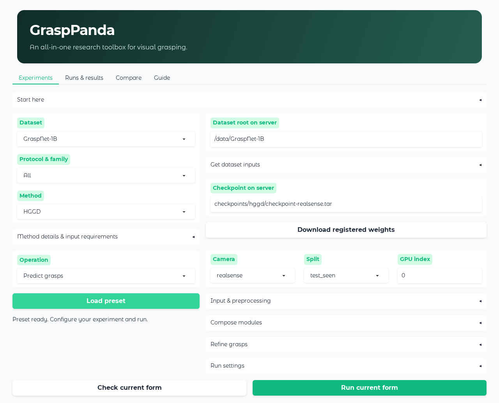
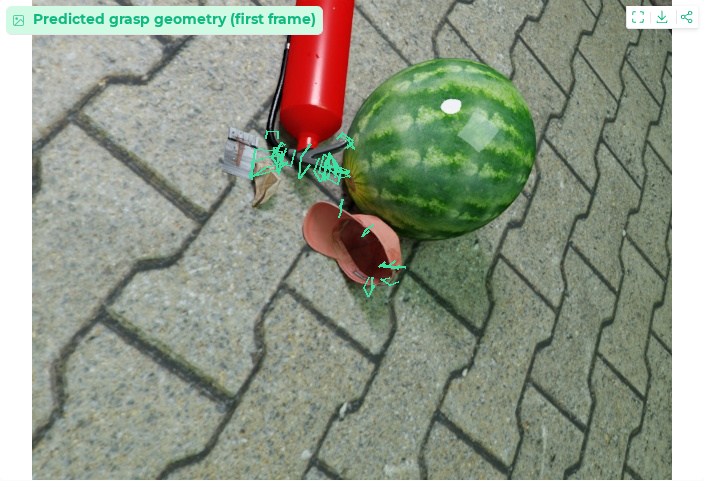
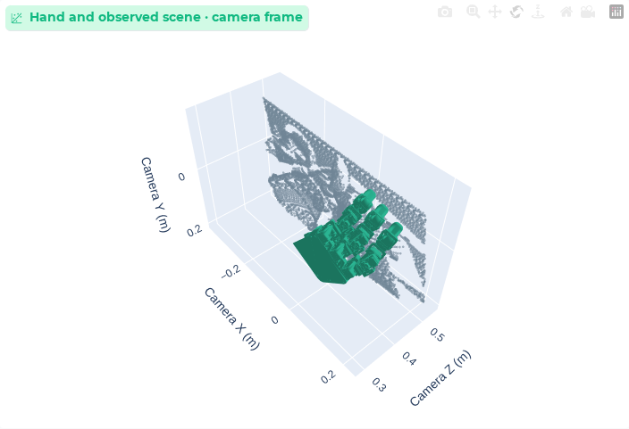
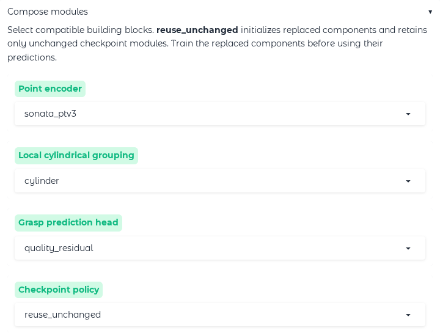

<div align="center">

# GraspPanda

### An All-in-One Research Toolbox for Visual Grasping

**Published methods. Composable models. One research workspace.**

[](LICENSE) [](docs/INSTALL.md) [](docs/INSTALL.md) [](https://github.com/Daeda1used/GraspPanda/actions/workflows/ci.yml)

[Quick start](#quick-start) · [Workbench](#the-research-workbench) · [Model zoo](#published-research-one-interface) · [Modules](docs/MODULES.md) · [Data & weights](docs/DOWNLOADS.md)

<table>
<tr>
<td align="center" width="25%"><h2>4</h2><a href="#dataset-coverage">Datasets</a></td>
<td align="center" width="25%"><h2>32</h2><a href="docs/METHODS.md">Method & recipe entries</a></td>
<td align="center" width="25%"><h2>37</h2><a href="#compose-your-next-model">Encoder options</a></td>
<td align="center" width="25%"><h2>59</h2><a href="grasppanda/resources/examples.json">Experiment presets</a></td>
</tr>
</table>

</div>

GraspPanda connects **parallel-jaw and dexterous grasping** in one configurable toolbox. Start from a published method, replace compatible components, then **train, predict, inspect and compare** through the same browser UI or CLI.


<details>
<summary><b>Coverage definitions & validation scope</b></summary>

Counts reflect the executable registries in this release: **4** dataset providers; **32** distinct method IDs with at least one operation across those datasets, including ports, fixed-input recipes and auxiliary workflows; **37** distinct non-`upstream` backbone selections, including configurable native encoders; **59** editable configuration examples. Method IDs are counted once across datasets. References without an adapter are excluded. See the [method registry](grasppanda/resources/methods.json), [capabilities](grasppanda/config.py), [dataset contracts](grasppanda/datasets.py), [component slots](grasppanda/components.py) and [presets](grasppanda/resources/examples.json).

A checkmark below means an implemented operation for the indicated adapter, not support for every method or arbitrary component combinations. Operational checks cover bounded inference, labelled optimization and browser workflows; full-split accuracy reproduction and training convergence have not been established. Exact protocols, adaptations and unavailable implementations are documented in [Methods & papers](docs/METHODS.md).

</details>

## The research workbench

**Choose a dataset → configure a model → run an experiment → inspect its outputs.**

[](docs/assets/workbench.png)

| | Research capability | What you can do |
|:---:|---|---|
| ✅ | **One shared environment** | Run integrated methods with pinned sources and shared native operators |
| ✅ | **Composable architectures** | Select compatible encoders, grouping, heads, sampling and temporal memory |
| ✅ | **Training & ablations** | Configure losses, augmentation, optimizers, schedules and experiment sweeps |
| ✅ | **Connected experiments** | Queue runs, inspect loss curves, resume supported trainers and reuse checkpoints |
| ✅ | **Visual inspection** | View grasp overlays, rotate hand geometry and export experiment artifacts |
| ✅ | **Guided setup** | Prepare registered weights and starter inputs; check required files before running |

<table>
<tr>
<th width="50%">Parallel-jaw predictions</th>
<th width="50%">Dexterous geometry</th>
</tr>
<tr>
<td><a href="docs/assets/parallel-grasps.png"></a></td>
<td><a href="docs/assets/dexterous-scene.png"></a></td>
</tr>
<tr>
<td>ZeroGrasp · calibrated grasp overlays</td>
<td>DexGraspNet 2.0 · rotatable hand and scene</td>
</tr>
</table>

<sub>Real interface captures. Configuration uses example paths; result panels show saved predictions on released starter observations, including a briefly trained hand model. These illustrate inspection features, not benchmark performance. [Image sources & terms](docs/THIRD_PARTY.md#readme-visuals).</sub>

## Dataset coverage

| Dataset | Research setting | Predict | Epoch training | Encoder composition | Evaluation |
|---|---|:---:|:---:|:---:|---|
| [**GraspNet-1B**](docs/DOWNLOADS.md) | Real clutter · parallel-jaw | ✅ | ✅ | ✅ | GraspNet AP |
| [**GraspClutter6D**](docs/DATASETS.md#graspclutter6d) | Real clutter · multiple cameras | ✅ | ✅ | ✅ | Native protocol AP |
| [**ZeroGrasp-11B**](docs/DATASETS.md#zerograsp-11b) | Synthetic RGB-D · reconstruction + grasps | ✅ | ✅ | ✅ | No held-out adapter |
| [**DexGraspNet 2.0**](docs/DATASETS.md#dexgraspnet-20) | Synthetic clutter · dexterous hands | ✅ | ✅ | ✅ | Simulation via upstream |

**Single-view, fused-view and temporal protocols** retain their own geometry and supervision contracts. GraspNet-trained Baseline and Graspness also support [transfer to GraspClutter6D](docs/DATASETS.md#graspclutter6d).

## Compose your next model

**Five component slots**, with method-specific compatibility checks for coordinates, units, sample indices and supervision.

| Component | Building blocks | Research controls |
|---|---|---|
| **Encoder** | **23 point**, **12 image**, **2 graph** options | Stages, widths, attention, freezing and registered pretraining |
| **Local grouping** | Cylindrical, multi-scale, ResLFE, KPConvX and candidate graphs | Neighborhoods, pooling and seed interaction |
| **Prediction head** | Native heads and residual quality scoring | Registered score mappings and objective settings |
| **Seed sampling** | Native sampling and object-balanced selection | Point budgets and dataset-specific seed policies |
| **Temporal memory** | SPGrasp's native temporal pathway | Prompted sequence experiments |

<details>
<summary><b>Explore the encoder families and the module composer</b></summary>

| Family | Representative registered choices |
|---|---|
| Point hierarchies | PointNet, PointNeXt, PointMLP, PointVector, PointMeta, PointCNN++, PointHR |
| Sparse and kernel networks | Sparse U-Net, TDUNet, OA-CNNs, KPConvX |
| Point transformers & pretraining | PTv2, Sonata/PTv3, OctFormer, Swin3D, SP2T, LitePT, Flash3D, Utonia, Concerto |
| Point sequence models | PointMamba, Point Cloud Mamba, released PointRWKV |
| Image encoders | ResNet, ConvNeXt V2, RepViT, MobileNetV4, DINOv2/v3, VMamba, RALA, MambaVision, EfficientViT, FastViT, Hiera |
| Candidate graphs | GraphSAGE and GATv2 |

[](docs/assets/composition.png)

The selector exposes compatible choices for the current method. For example, Graspness point features and HGGD image features use different interfaces. The [module guide](docs/MODULES.md) lists exact contracts and configurable parameters.

</details>

A composition is an editable configuration:

```yaml
# Component overrides for a compatible Graspness training configuration.
modules:
  backbone: sonata_ptv3
  crop: cylinder
  head: quality_residual
checkpoint_policy: reuse_unchanged
```

Generate a complete starter with `./panda init --example compose-baseline -o composition.local.yaml`, or choose components in the browser. Train replaced components before prediction; use `strict` to reload the resulting checkpoint. See [training and composition](docs/MODULES.md).

## Published research, one interface

Selected integrations span **CVPR, ICCV, ECCV, CoRL, NeurIPS and RA-L**. The full catalogue also covers ICRA, IROS and journal methods, with original code and paper links.

| Method | Publication | Observation | Toolbox workflow | Sources |
|---|---|---|---|---|
| **Graspness** | ICCV 2021 | Single-view points | Predict · evaluate · epoch training · compose | [Paper](https://openaccess.thecvf.com/content/ICCV2021/papers/Wang_Graspness_Discovery_in_Clutters_for_Fast_and_Accurate_Grasp_Detection_ICCV_2021_paper.pdf) / [Code](https://github.com/graspnet/graspness_unofficial) |
| **Scale-Balanced-Grasp** | CoRL 2022 | Single-view points | Predict · evaluate · epoch training · compose | [Paper](https://arxiv.org/pdf/2212.05275) / [Code](https://github.com/mahaoxiang822/Scale-Balanced-Grasp) |
| **HGGD** | RA-L 2023 | Single-view RGB-D | Predict · evaluate · epoch training · compose | [Paper](https://arxiv.org/pdf/2403.18546) / [Code](https://github.com/THU-VCLab/HGGD) |
| **EconomicGrasp** | ECCV 2024 | Single-view points | Predict · evaluate · epoch training · compose | [Paper](https://arxiv.org/pdf/2407.08366) / [Code](https://github.com/iSEE-Laboratory/EconomicGrasp) |
| **Generalizing-Grasp** | CVPR 2024 | Fused views | Fused prediction · short training · refinement | [Paper](https://openaccess.thecvf.com/content/CVPR2024/papers/Ma_Generalizing_6-DoF_Grasp_Detection_via_Domain_Prior_Knowledge_CVPR_2024_paper.pdf) / [Code](https://github.com/mahaoxiang822/Generalizing-Grasp) |
| **ActiveNGF** | NeurIPS 2024 | Active views | Fixed two-view optimization recipe | [Paper](https://proceedings.neurips.cc/paper_files/paper/2024/file/4364fef031fdf7bfd9d1c9c56b287084-Paper-Conference.pdf) / [Code](https://github.com/mahaoxiang822/ActiveNGF) |
| **ZeroGrasp** | CVPR 2025 | RGB-D + instance masks | Native prediction · epoch training · compose | [Paper](https://arxiv.org/pdf/2504.10857) / [Code](https://github.com/sh8/ZeroGrasp) |
| **DexGraspNet 2.0** | CoRL 2024 | Single-view depth | Diffusion + author hand baselines · train · compose | [Paper](https://arxiv.org/pdf/2410.23004) / [Code](https://github.com/PKU-EPIC/DexGraspNet2) |

**[Browse all methods, PDFs, source repositories and adapter notes →](docs/METHODS.md)**

## Quick start

Use **Linux x86-64 + a supported NVIDIA GPU**. Install [uv, CUDA 11.8 and the system prerequisites](docs/INSTALL.md), then:

```bash
git clone --depth 1 https://github.com/Daeda1used/GraspPanda.git
cd GraspPanda
./panda install
./panda ui
```

Open **http://127.0.0.1:7860**:

| Your starting point | In the browser |
|---|---|
| **No dataset yet** | **Try the author sample** → download weights → run ASGrasp's included stereo sample |
| **Try another dataset** | Select **Dataset** → **Get dataset inputs** → prepare data and weights → check inputs → run |
| **GraspNet ready** | **Start a GraspNet experiment** → set your data path → download weights → check inputs → run |
| **A new model idea** | Choose a method → **Compose modules** → train the replacement → reuse its checkpoint |

Use **Check current form** before starting. Predictions, loss curves and checkpoints appear in **Runs & results**. For downloads, follow the [dataset and weight guide](docs/DOWNLOADS.md); methods and JSON presets can be browsed before installing the GPU runtime.

## Documentation

| Guide | Contents |
|---|---|
| [Install](docs/INSTALL.md) | Requirements, shared environment and troubleshooting |
| [Datasets](docs/DATASETS.md) · [Data & weights](docs/DOWNLOADS.md) | Observation protocols, starter downloads, archives and pretrained models |
| [Usage](docs/USAGE.md) | Browser, CLI, training, resume and experiment sweeps |
| [Modules](docs/MODULES.md) · [Reference](docs/REFERENCE.md) | Compatible components, parameters and extension interfaces |
| [Methods & papers](docs/METHODS.md) | Operations, adaptations, paper PDFs and original implementations |

The source stays focused: `grasppanda/` contains the toolbox and installation recipes; `docs/` contains the guides. Data, weights, downloaded implementations and experiment outputs are created locally.

## Build on GraspPanda

Bring your next method, component or dataset through the [extension guide](docs/REFERENCE.md#extending-grasppanda). Contributions with explicit input contracts and reproducible configurations are welcome. When using an integrated method, cite its original paper.

[MIT toolbox license](LICENSE) · [Third-party terms](docs/THIRD_PARTY.md) · [Report an issue](https://github.com/Daeda1used/GraspPanda/issues)
