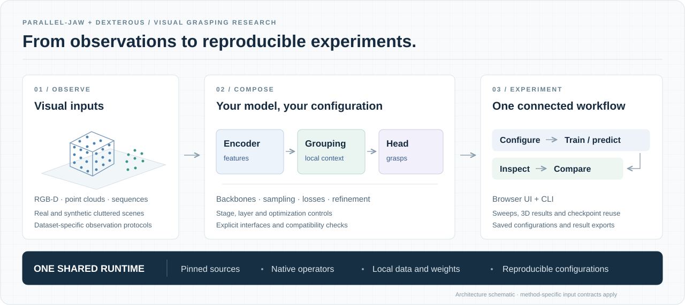

<div align="center">

# GraspPanda

### An All-in-One Research Toolbox for Visual Grasping

**Reproduce methods. Compose models. Run experiments.**

[](LICENSE)
[](docs/DOWNLOADS.md)
[](docs/INSTALL.md)
[](https://github.com/Daeda1used/GraspPanda/actions/workflows/ci.yml)

[Get started](#quick-start) · [Methods & papers](docs/METHODS.md) · [Compose modules](docs/MODULES.md) · [Data & weights](docs/DOWNLOADS.md)

</div>



GraspPanda brings visual grasping research on **GraspNet-1B** into one configurable workspace. Start with a published method, replace compatible components, and train, inspect or compare experiments through the **browser UI or CLI**.

**28 method workflows · 7 epoch-training adapters · one shared Python environment.** Available operations and observation protocols are documented in the [method catalogue](docs/METHODS.md).

## A research stack you can compose

| Layer | Explore |
|---|---|
| **Grasp methods** | GraspNet Baseline, Graspness, HGGD, Scale-Balanced-Grasp, EconomicGrasp, RegionNormalizedGrasp, FineGrasp and more |
| **Visual encoders** | PointNet families, sparse CNNs, point transformers, point Mamba models, DINO, VMamba, EfficientViT and FastViT |
| **Model components** | Local grouping, sampling, seed interaction, score heads and pose refinement; stage and layer controls for registered encoders |
| **Training controls** | Loss formulations, augmentation, optimizers, schedules, checkpoint transfer and resume |
| **Experiment workflow** | Editable presets, configuration sweeps, queued runs, grasp previews, loss curves, checkpoint reuse and result export |

Compatibility checks cover **geometry, sample indices and supervision** as well as tensor shapes. Single-view, fused-view and temporal workflows retain their own input contracts. Original implementations, pinned dependencies and shared native operators sit behind the same interface.

## Quick start

Use Linux x86-64 with a supported NVIDIA GPU. Install [uv, CUDA 11.8 and the system prerequisites](docs/INSTALL.md), then:

```bash
git clone --depth 1 https://github.com/Daeda1used/GraspPanda.git
cd GraspPanda
./panda install
./panda ui
```

Open **http://127.0.0.1:7860**:

**Choose a method → Load preset → Set data path → Download weights → Run.**

View predictions and checkpoints in **Runs & results**. Expand **Compose modules** to build your own model.

**No dataset yet?** [Run the included author sample](docs/DOWNLOADS.md#start-without-graspnet), or [download your first GraspNet split](docs/DOWNLOADS.md#graspnet-1b). You can browse methods and generate JSON presets before installing the GPU runtime.

## Documentation

| Guide | Contents |
|---|---|
| [Install](docs/INSTALL.md) | Requirements, shared environment and troubleshooting |
| [Data & weights](docs/DOWNLOADS.md) | Dataset archives, pretrained weights and preparation |
| [Usage](docs/USAGE.md) | Browser, CLI, training, resume and experiment sweeps |
| [Modules](docs/MODULES.md) | Compatible components and configuration |
| [Methods & papers](docs/METHODS.md) | Available operations, limitations, paper PDFs and original code |

The source stays small: `grasppanda/` contains the toolbox and installation recipes; `docs/` contains the guides. Data, weights, downloaded implementations and experiment outputs are created locally.

## Build on GraspPanda

Add a method, component or dataset through the [extension guide](docs/REFERENCE.md#extending-grasppanda). Contributions with clear input contracts and reproducible configurations are welcome. When using an integrated method, cite its original paper; source and weight terms are listed in [third-party notices](docs/THIRD_PARTY.md).

[MIT license](LICENSE) · [Report an issue](https://github.com/Daeda1used/GraspPanda/issues)
